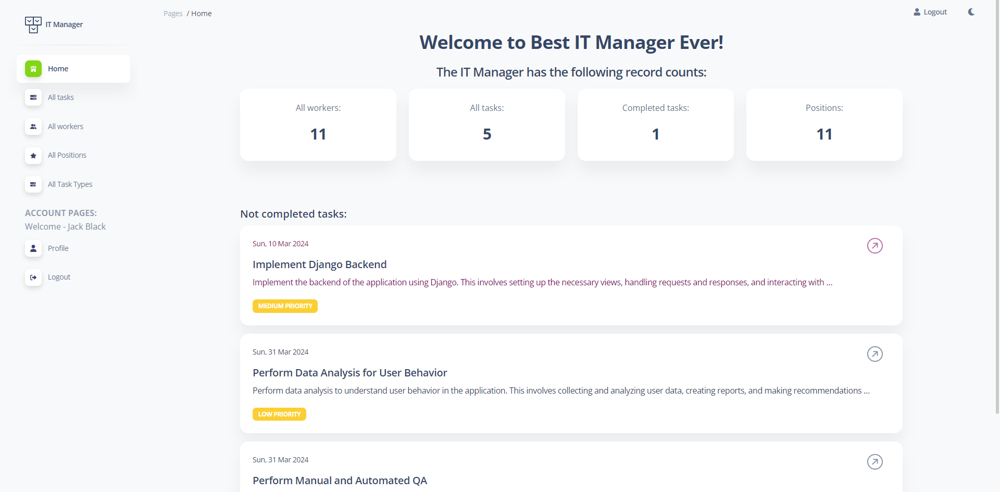

# IT company task manager

> Django project to keep track of the tasks, prioritize work, set deadlines, 
> assign a worker responsible for a task, and
> achieve company goals.
 

## Check it out

[IT company task manager project deployed to Render](https://it-company-task-manager-vd82.onrender.com/)

### User credentials for tests:

```
login: test_user
password: test_123_test
```

Feel free to create new tasks, assign them to teammates.


## Installing / Getting started

Python3 must be already installed.

```shell
git clone https://github.com/MilArtem78/IT-company-task-manager.git
cd it_company_task_manager/
python3 -m venv venv
source venv/bin/activate
pip install -r requirements.txt
python manage.py runserver
```


## Features

* Authentication functionality for Worker/User;
* Paginated list of tasks, their statuses, priorities & deadlines with the ability to search by task name; 
* Detailed information about a specific task, including task type, assignees;
* Detailed information about a worker and their assigned tasks;
* Admin panel for advanced managing.

## DB-structure diagram:


## Demo

